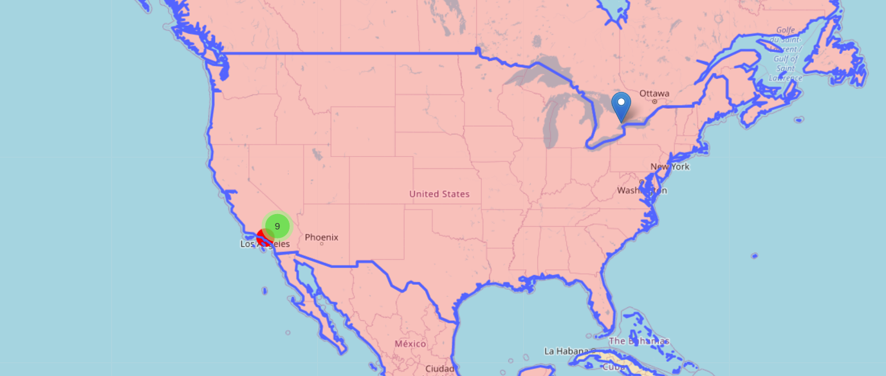

# **FYL** 

**FYL** is short for **F**ilms near **Y**our **L**ocation and it is a program that can determine the 10 movies shot nearest to your location.

## Installation

Clone the repository

```bash
git clone https://github.com/Adeon18/FYL.git
```

Use the package manager [pip](https://pip.pypa.io/en/stable/) to install the needed libraries.

```bash
pip install requirements.txt
```

## Usage

The program asks you for the year you want the movies to be, your location(**MUST BE A VALID LOCATION**) and if you want to prioritise speed or precision. Speed calculates everything **under 2 minutes** under all circumstances but works with **presition to the country**. Precision can work **incredibly long** depending on the amount of data but works with **presition as exact as possible**. You also always get the **progress bar** so you can see if the option chosen is right. By default it works with only **1000** movies in _short.list_, you can change it to 1500000(_locations.list_) movies in manager.py. 

```bash
python FYL_modules/main.py
Please enter a year you would like to have a map for: 2015
Please enter YOUR location (format: lat, long): 34.052235, -118.243683
Type "speed" or "precision" depending which you want most(speed - very quick but not precise, precision - VERY slow but presice): precision
Starting year sync..
Ended year sync in 0.007 sec
Finding coords.. for 20 elems
[=============================================================================================================================] 100%
Found coords in 30.22 sec
Finding distance..
Found distance in 0.0 sec
Sorting..
Sorted in 0.0 sec
Finished, look at 2015_movies_map.html
```



## License

[MIT](https://choosealicense.com/licenses/mit/)